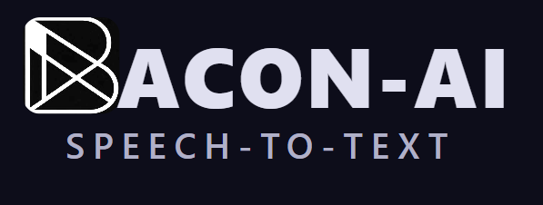

<p align="center">
  
</p>

<h1 align="center">BACON-AI Speech-to-Text</h1>

<p align="center">
  <strong>Free, private, local speech-to-text for AI chatbots and CLI tools</strong>
</p>

<p align="center">
  <a href="#features">Features</a> &bull;
  <a href="#how-it-works">How It Works</a> &bull;
  <a href="#installation">Installation</a> &bull;
  <a href="#usage-with-ai-tools">Usage with AI Tools</a> &bull;
  <a href="#roadmap">Roadmap</a> &bull;
  <a href="#coming-soon">Coming Soon</a>
</p>

<p align="center">
  
  
  
  
  
  
</p>

> **Note:** This is the open-source community edition. A professional edition with advanced features is in development — see [Coming Soon](#coming-soon) below.

---

## What is BACON-AI Speech-to-Text?

BACON-AI Speech-to-Text is a local, private speech-to-text platform that integrates seamlessly with AI development tools like Claude Code, ChatGPT, Cursor, and more.

**Speak naturally. Get clean text. Inject it anywhere.**

No cloud. No subscription. No audio leaving your machine.

---

## Features

| Feature | Status |
|---------|--------|
| Live microphone transcription (Whisper, local GPU) | ✅ |
| Push-to-talk / Voice activation / Toggle modes | ✅ |
| Whisper model selector (tiny → large-v3) | ✅ |
| AI text refinement (remove filler words, reformat) | ✅ |
| 6 AI providers: Ollama, Groq, OpenAI, Anthropic, Gemini, Claude CLI | ✅ |
| 12 prompt templates (Speech Cleanup, Technical Docs, Email, WhatsApp...) | ✅ |
| Type transcription to any window (Target Window) | ✅ |
| WebSocket bridge to Claude Code | ✅ |
| File transcription (audio/video files) | ✅ |
| YouTube & URL transcription | ✅ |
| Text Editor tab (load PDF/DOCX, edit, refine) | ✅ |
| Elisabeth voice assistant (discuss mode) | ✅ |
| History sidebar | ✅ |
| System tray icon (AHK) | ✅ |

---

## How It Works

```
Microphone → Faster-Whisper (local) → AI Refiner (optional) → Clipboard / Target Window / Claude Code
```

1. **Record** with push-to-talk, voice activation, or toggle button
2. **Transcribe** locally using Faster-Whisper (runs entirely on your machine)
3. **Refine** with AI to remove filler words and improve formatting
4. **Output** by typing to any window, copying, or injecting into Claude Code

---

## Installation

### Prerequisites

- Python 3.10+ with `uv`
- Node.js 18+ with npm
- NVIDIA GPU (optional but recommended)

### Quick Start

```bash
git clone https://github.com/BACON-AI-CLOUD/bacon-ai-speech-to-text.git
cd bacon-ai-speech-to-text

# Start frontend + backend
./start-dev.sh       # Linux / WSL2
start-dev.bat        # Windows

# Open in browser: http://localhost:5002
```

---

## Usage with AI Tools

### Claude Code
The WebSocket bridge injects transcribed text directly into your active Claude Code session. Hold your hotkey, dictate, and your words appear in Claude Code — hands-free.

### Any AI Browser Tab
Use the Target Window feature to type transcribed text into any browser tab or application window — ChatGPT, Gemini, Cursor, VS Code, Word, Outlook.

### File Transcription
Drag any audio/video file (or paste a YouTube URL) onto the File tab to get a full transcript — then refine, edit, and export it.

---

## Privacy

- Raw audio **never leaves your machine**
- Whisper transcription runs entirely on your local GPU/CPU
- Cloud AI providers (optional) receive **text only**, never audio
- API keys stored in `~/.config/bacon-ai-voice/.env`, never in the repo

---

## Roadmap

| Version | Status | Highlights |
|---------|--------|-----------|
| v1.0 | ✅ Released | Core STT, 3 activation modes, WebSocket bridge |
| v1.1 | ✅ Released | AI Refiner, Groq + Ollama + Gemini |
| v1.2 | ✅ Released | OpenAI + Anthropic + Claude CLI, discuss mode |
| v1.3 | ✅ Released | File transcription, system tray, hotkeys |
| v1.4 | ✅ Released | Quick Controls, target window selection |
| v1.5 | ✅ Released | Text Editor tab, YouTube/URL, PDF/DOCX, editable results |
| **v1.6** | 🚧 In Progress | Enhanced UX, chat tab, dictation mode |
| v2.0 | 📋 Planned | See below ↓ |

---

## Coming Soon

> We are working on a significant upgrade. Here is what is on the horizon — without giving away the implementation details.

### 🎯 Smarter Context Awareness
Future versions will understand **what you are working on** and tailor their output accordingly — without you having to switch templates manually. Imagine the system knowing whether you are writing code, composing an email, or drafting a report, and adjusting its output format automatically.

### 🔗 Deeper Tool Integration
We are building **native integrations** that go beyond the current WebSocket bridge. Think direct plugin hooks for popular developer tools — not just "type text", but full two-way awareness of what the tool knows and needs.

### 🌍 Multi-Language Intelligence
Beyond basic transcription in multiple languages: understanding **code-switching** (mixing languages mid-sentence), technical vocabulary in non-English languages, and automatic language detection per session.

### 🧠 Persistent Session Memory
A future version will maintain awareness of your **ongoing work sessions** — so when you come back to a project after a break, the system picks up context without you having to re-explain.

### 📊 Structured Data Extraction
Speech-to-structured-data: dictate naturally and have the system extract **tables, action items, decisions, dates** and export them in structured formats (JSON, CSV, calendar events) — not just clean text.

### ⚡ Real-Time Collaboration
Early-stage research into **multi-user voice sessions** — where multiple people can speak into a shared session, with speaker identification and automatic meeting minutes generation.

---

## Contributing

Issues and pull requests are welcome. Please read the project `CLAUDE.md` before contributing to understand the architecture and coding conventions.

---

## License

MIT — free for personal and commercial use.

---

<p align="center">
  Built with ❤️ by the <strong>BACON-AI</strong> team
</p>
