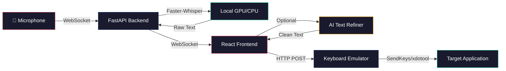
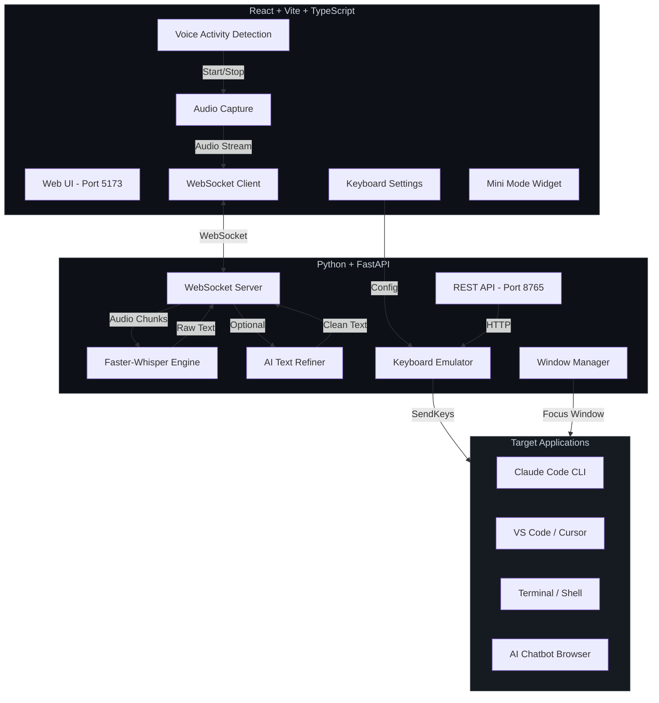
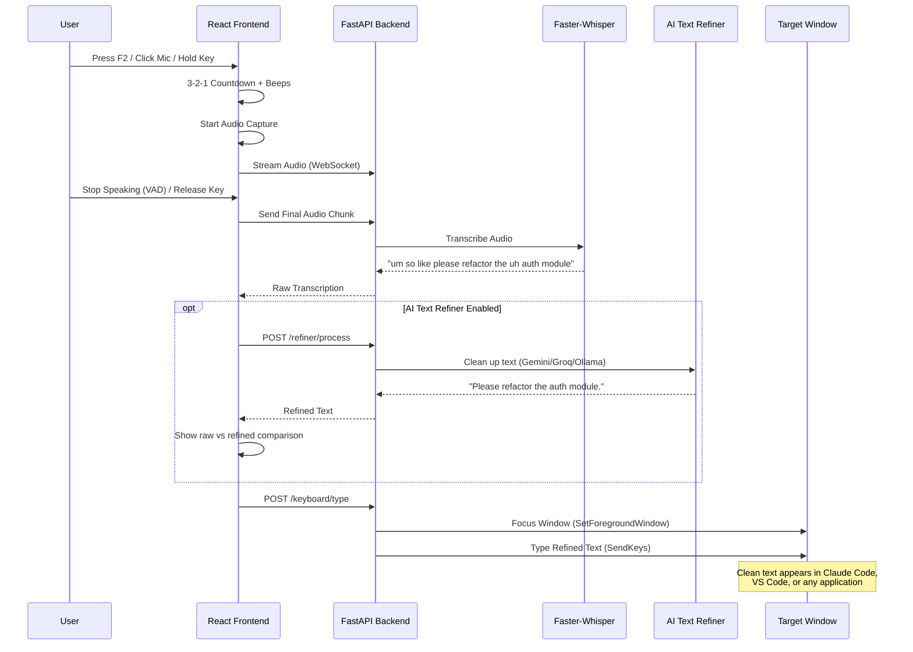
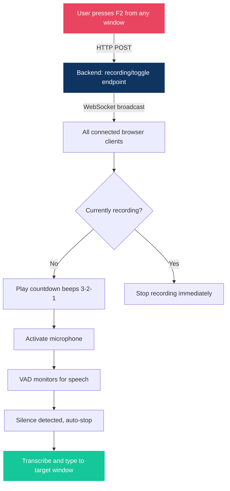
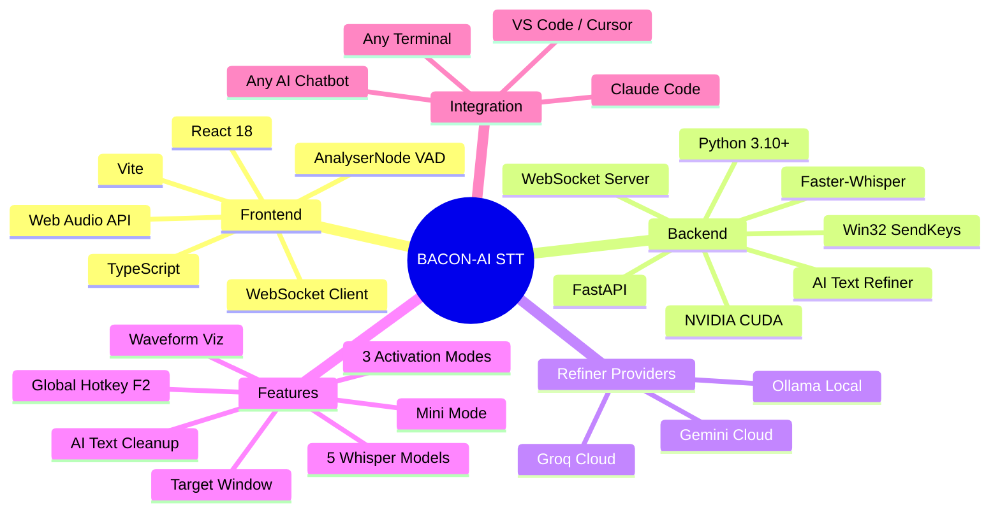

<p align="center">
  
</p>

<h1 align="center">BACON-AI Speech-to-Text</h1>

<p align="center">
  <strong>Free, private, local speech-to-text for AI chatbots and CLI tools</strong>
</p>

<p align="center">
  <a href="#features">Features</a> &bull;
  <a href="#how-it-works">How It Works</a> &bull;
  <a href="#installation">Installation</a> &bull;
  <a href="#usage-with-ai-tools">Usage with AI Tools</a> &bull;
  <a href="#architecture">Architecture</a> &bull;
  <a href="#roadmap">Roadmap</a> &bull;
  <a href="#training--consulting">Training & Consulting</a>
</p>

<p align="center">
  
  
  
  
  
  
</p>

> **Warning**
> This project is currently in **Alpha testing**. It is functional and actively used in development, but you may encounter bugs, rough edges, or breaking changes between releases. Feedback, bug reports, and contributions are very welcome! Please [open an issue](https://github.com/BACON-AI-CLOUD/bacon-ai-speech-to-text/issues) if you run into problems.

---

## Why BACON-AI Speech-to-Text?

Tired of typing long prompts into AI chatbots? Want to dictate naturally to **Claude Code**, **ChatGPT**, **Cursor**, or any AI CLI tool?

**BACON-AI Speech-to-Text** turns your voice into text and types it directly into any application window. It runs **100% locally** on your machine - no cloud APIs, no subscriptions, no data leaving your computer.

### 10x Faster Coding with Voice

Speaking is **3-5x faster** than typing. When you're working with AI coding assistants like Claude Code, the bottleneck isn't the AI - it's how fast you can describe what you want. With BACON-AI STT, you can:

- **Describe complex refactors** in natural language faster than you can type them
- **Dictate detailed prompts** with context, requirements, and edge cases
- **Brain-dump your thoughts** and the AI Text Refiner cleans them up automatically
- **Keep your hands on the keyboard** for coding while using voice for AI commands
- **Multi-task effectively** - speak to your AI while reviewing code on another screen
- **Vibe code naturally** - ramble your ideas and let the refiner turn them into clear, structured prompts

Developers using voice input with AI tools report **up to 10x productivity gains** for prompt-heavy workflows. Stop hunting for the right words on your keyboard - just say them.

### Key Benefits

| Benefit | Description |
|---------|-------------|
| **10x Faster Prompting** | Speak naturally at 150+ words/minute vs typing at 40-60 wpm |
| **Completely Free** | No API keys, no subscriptions, no usage limits. Uses open-source Whisper models |
| **100% Private** | Audio never leaves your machine. All processing is local |
| **GPU Accelerated** | Automatic NVIDIA CUDA detection for blazing fast transcription |
| **Selectable Models** | Choose from 5 Whisper models (39MB to 1.5GB) to balance speed vs accuracy |
| **Type Anywhere** | Automatically types transcribed text into any window - VS Code, terminal, browser |
| **Global Hotkey** | Press F2 from any application to start/stop recording |
| **AI Text Refiner** | Automatically clean up dictation - remove filler words, fix grammar, restructure rambling into clear prompts. Powered by Gemini, Groq, or local Ollama |
| **Multiple Modes** | Push-to-talk, toggle button, or voice activity detection (VAD) |
| **Mini Mode** | Collapse to a tiny widget you can dock in any corner of your screen |
| **Real-time Feedback** | Live waveform visualization, countdown overlay, audio level meters |
| **Cross-Platform** | Works on Windows (WSL2), Linux, and macOS |

---

## Features

### Voice Activation Modes

- **Push-to-Talk** - Hold a configurable key to record, release to transcribe
- **Toggle** - Click to start recording, click again to stop (auto-stops on silence)
- **Voice Activity Detection (VAD)** - Automatically detects when you start and stop speaking

### Whisper Model Selection

Choose the right model for your hardware and needs:

| Model | Size | Speed | Accuracy | Best For |
|-------|------|-------|----------|----------|
| `tiny` | 39 MB | Fastest | Basic | Quick commands, fast hardware |
| `base` | 74 MB | Fast | Medium | General dictation |
| `small` | 244 MB | Moderate | Good | Balanced quality/speed |
| `medium` | 769 MB | Slower | High | Detailed transcription |
| `large-v3` | 1.5 GB | Slowest | Best | Maximum accuracy, GPU recommended |

Models are downloaded automatically on first use with a progress indicator.

### AI Text Refiner (v1.1)

When you dictate naturally, your speech is full of filler words, false starts, and rambling. The AI Text Refiner automatically cleans up your transcriptions before they reach your AI tool:

| What You Say | What Gets Typed |
|-------------|----------------|
| "um so basically i was uh thinking that we should like you know maybe try a different approach to the problem" | "I was thinking that we should maybe try a different approach to the problem." |
| "ok so uh the thing is right we need to like deploy this to um production but first we gotta make sure that the the database migrations are like running properly" | "We need to deploy this to production, but first we've got to make sure that the database migrations are running properly." |
| "uh yeah its its broken again" | "Yeah, it's broken again." |

**Three provider options:**

| Provider | Type | API Key | Best For |
|----------|------|---------|----------|
| **Ollama** | Local | None needed | Privacy-first, offline use, free |
| **Gemini** | Cloud | Free tier available | Fast, high quality, generous free quota |
| **Groq** | Cloud | Free tier available | Ultra-fast inference, great for real-time |

**Perfect for vibe coding** - just brain-dump your thoughts and let the refiner turn your stream-of-consciousness into clear, actionable prompts for Claude Code, ChatGPT, or any AI assistant.

### Smart Keyboard Integration

- **Auto-focus target window** - Automatically switches to your chosen application before typing
- **Window selector** - Pick from a dropdown of active windows, or type a partial title match
- **Configurable typing** - Set typing speed, auto-copy to clipboard, browser notifications

### Mini Mode

Collapse the full app into a compact floating widget:
- Small BACON-AI logo + microphone button
- Countdown badge for remote-triggered recordings
- One-click expand back to full view
- Perfect for docking in a screen corner while you work

### Global Hotkey

Press **F2** (configurable) from **any application** to toggle recording. No need to switch to the browser.

---

## How It Works



### System Architecture



### Recording Flow



### Global Hotkey Flow



---

## Installation

### Prerequisites

- **Python 3.10+** with pip or [uv](https://github.com/astral-sh/uv)
- **Node.js 18+** with npm
- **NVIDIA GPU** (optional but recommended for speed)
- **Windows 10/11** (WSL2), **Linux**, or **macOS**

### Quick Start

#### 1. Clone the Repository

```bash
git clone https://github.com/BACON-AI-CLOUD/bacon-ai-speech-to-text.git
cd bacon-ai-speech-to-text
```

#### 2. No API Keys Required (for core STT)

**Speech-to-text is 100% free.** Whisper is an open-source model from OpenAI that runs locally on your machine - no API keys, no subscriptions, no usage limits.

> **Optional (v1.1):** The AI Text Refiner can use cloud LLMs (Gemini, Groq) for cleaning up dictation. These have free tiers. Or use **Ollama** for fully local, free refinement with no API key at all. The refiner is disabled by default - everything works without it.

#### 3. Start the Backend

```bash
cd src/backend

# Using uv (recommended)
uv venv && uv pip install -e .
uv run uvicorn app.main:app --host 0.0.0.0 --port 8765

# Or using pip
python -m venv .venv
source .venv/bin/activate  # Linux/macOS
# .venv\Scripts\activate   # Windows
pip install -e .
uvicorn app.main:app --host 0.0.0.0 --port 8765
```

The backend will:
- Detect your GPU automatically (CUDA, ROCm, or CPU fallback)
- Download the selected Whisper model on first use (~74 MB for `base`)
- Start the WebSocket server on **port 8765**
- Start the REST API for keyboard typing and window management

#### 4. Start the Frontend

Open a **second terminal** and run:

```bash
cd src/frontend
npm install
npm run dev -- --host 0.0.0.0
```

Open **http://localhost:5173** in your browser.

#### 5. Start Using It

1. Click the **microphone button** or press your configured hotkey
2. Wait for the **3-2-1 countdown beeps**
3. **Speak** your prompt or command
4. The app transcribes your speech and displays the text
5. (Optional) Enable **"Type to keyboard"** in Settings to auto-type into any window

#### 6. (Optional) Enable Global Hotkey

For system-wide recording from any application:

**Windows (PowerShell):**
```powershell
# Run in a separate terminal - keeps running in background
powershell.exe -ExecutionPolicy Bypass -File scripts/global-hotkey.ps1

# Now press F2 from ANY window to toggle recording
# Use -Key parameter to change the hotkey:
powershell.exe -ExecutionPolicy Bypass -File scripts/global-hotkey.ps1 -Key "F4"
```

**Linux (X11):**
```bash
chmod +x scripts/global-hotkey.sh
./scripts/global-hotkey.sh
# Requires: xbindkeys, curl
```

### WSL2 Setup Notes

If running on Windows with WSL2:

```bash
# Start from WSL terminal
wsl

# Terminal 1: Backend
cd /mnt/c/path/to/bacon-ai-speech-to-text/src/backend
uv venv && uv pip install -e .
uv run uvicorn app.main:app --host 0.0.0.0 --port 8765

# Terminal 2: Frontend
cd /mnt/c/path/to/bacon-ai-speech-to-text/src/frontend
npm install && npm run dev -- --host 0.0.0.0

# Terminal 3 (optional): Global Hotkey (run from Windows PowerShell, not WSL)
powershell.exe -ExecutionPolicy Bypass -File scripts/global-hotkey.ps1
```

> **Note:** The global hotkey script must run from **Windows PowerShell** (not WSL) since it uses Win32 APIs to capture system-wide keypresses.

---

## Usage with AI Tools

### Claude Code CLI

BACON-AI Speech-to-Text is designed to work seamlessly with [Claude Code](https://docs.anthropic.com/en/docs/claude-code):

1. Open Claude Code in your terminal
2. Open BACON-AI STT in your browser (http://localhost:5173)
3. In Settings, enable **"Type to keyboard"** and select your terminal window
4. Speak your prompt - it gets typed directly into Claude Code

**With Global Hotkey:**
- Run `global-hotkey.ps1` in a separate terminal
- Press **F2** from anywhere to dictate to Claude Code
- Your speech is transcribed and typed into the selected terminal

### REST API Integration (for AI Agents & Scripts)

The backend exposes a REST API that allows **any script, AI agent, or CLI tool** to remotely trigger recording. This is ideal for integrating voice input into automated workflows, Claude Code hooks, or custom tooling.

**Toggle Recording via REST API:**

```bash
# Toggle recording on/off from any terminal or script
curl -X POST http://localhost:8765/recording/toggle

# Response: {"toggled": true, "clients": 1}
```

When triggered via REST API:
1. All connected browser clients receive the toggle command via WebSocket
2. A **3-2-1 countdown** plays (configurable beep count)
3. The microphone activates and records your speech
4. **Voice Activity Detection (VAD)** automatically stops recording after silence
5. Text is transcribed and (if enabled) typed into your target window

**Example: Claude Code Hook Integration**

You can create a Claude Code hook that triggers voice input before prompting:

```json
{
  "hooks": {
    "PrePromptSubmit": [
      {
        "command": "curl -s -X POST http://localhost:8765/recording/toggle",
        "description": "Trigger voice recording before prompt"
      }
    ]
  }
}
```

**Example: Shell Alias for Quick Voice Input**

```bash
# Add to your .bashrc or .zshrc
alias voice="curl -s -X POST http://localhost:8765/recording/toggle"

# Then just type 'voice' to start/stop recording from any terminal
```

**Available REST API Endpoints:**

| Endpoint | Method | Description |
|----------|--------|-------------|
| `/health` | GET | Server health, GPU info, model status |
| `/models` | GET | List available Whisper models |
| `/models/{name}/load` | POST | Load/switch Whisper model |
| `/transcribe` | POST | Transcribe uploaded audio file |
| `/recording/toggle` | POST | Toggle recording on all connected clients |
| `/keyboard/type` | POST | Type text at cursor via keyboard emulation |
| `/keyboard/status` | GET | Check keyboard emulation availability |
| `/windows` | GET | List visible desktop windows |
| `/integrations` | GET | List available integration backends |
| `/integrations/send` | POST | Send text to selected backend |
| `/refiner/process` | POST | Refine text through active LLM provider |
| `/refiner/config` | GET | Get refiner configuration and provider status |
| `/refiner/config` | PUT | Update refiner settings (provider, API keys, prompt) |
| `/refiner/test` | POST | Test refiner with sample text |

### Vibe Coding Workflow

The AI Text Refiner transforms BACON-AI STT into the ultimate **vibe coding** tool. Instead of carefully typing precise prompts, just speak naturally:

1. **Enable the Text Refiner** in Settings (select Gemini, Groq, or Ollama)
2. **Press F2** and brain-dump your thoughts:
   > "ok so um basically what I need is like a function that takes in a list of users and then filters out the ones that haven't logged in for like 30 days and then sends them an email reminder, oh and also make sure to handle the case where the email is invalid"
3. **The refiner cleans it up** automatically:
   > "Create a function that takes a list of users, filters out those who haven't logged in for 30 days, and sends them an email reminder. Handle the case where the email is invalid."
4. **The clean text gets typed** into Claude Code, ChatGPT, or your IDE

No more wrestling with phrasing. No more deleting and retyping. Just think out loud and let the AI clean it up.

### ChatGPT / Claude.ai / Any AI Chatbot

1. Open your AI chatbot in a browser tab
2. Open BACON-AI STT in another tab
3. In Settings, select the chatbot's browser window as the target
4. Speak naturally - text appears in the chatbot's input field

### VS Code / Cursor / Any IDE

1. Set your IDE window as the target in Settings
2. Use push-to-talk or global hotkey to dictate
3. Code comments, commit messages, documentation - all by voice

### Mini Mode for Productivity

1. Click the collapse button in the header
2. Resize your browser window to just fit the mini widget
3. Dock it in a corner of your screen
4. Use the global hotkey (F2) or click the mic button to record

---

## Configuration

All settings are stored in your browser's localStorage and persist across sessions.

| Setting | Default | Description |
|---------|---------|-------------|
| Activation Mode | Push-to-talk | Toggle, push-to-talk, or VAD |
| Hotkey | Space | Key for push-to-talk mode |
| Whisper Model | base | tiny, base, small, medium, large-v3 |
| Backend URL | ws://localhost:8765 | WebSocket connection URL |
| VAD Threshold | 0.015 | Voice activity detection sensitivity |
| Silence Timeout | 2000ms | How long to wait before auto-stopping |
| Countdown Beeps | 3 | Beeps before recording starts (0 = instant) |
| Beep Volume | 30% | Volume of audio feedback |
| Auto-Copy | Off | Copy transcriptions to clipboard |
| Type to Keyboard | Off | Auto-type into target window |
| Target Window | Last active | Window to type into |
| Notifications | Off | Browser notifications for transcriptions |
| **Text Refiner** | Off | AI-powered text cleanup (v1.1) |
| Refiner Provider | Ollama | Ollama (local), Gemini (cloud), or Groq (cloud) |
| Custom Prompt | Default | Override the LLM system prompt for refinement |

Settings can be exported/imported as JSON files for backup or sharing.

**Refiner API keys** are stored securely on the backend (`config.json`), never in the browser. Configure them through the Settings panel or via `PUT /refiner/config`.

---

## Technology Stack



---

## Roadmap

### Current Release (v1.1) - Speech-to-Text + AI Refiner

- Local Whisper transcription with GPU acceleration
- Three activation modes (push-to-talk, toggle, VAD)
- Keyboard typing integration with window targeting
- Global hotkey (F2) for system-wide recording
- Mini mode for compact screen usage
- Settings persistence and import/export
- **AI Text Refiner** - Clean up dictation with Gemini, Groq, or local Ollama
- **Raw vs Refined comparison** - Side-by-side view with "Use Raw" / "Use Refined" choice

### Coming Soon

| Version | Feature | Description |
|---------|---------|-------------|
| **v1.2** | **Text-to-Speech (TTS)** | Hear AI responses read back to you. Integration with Edge TTS (free) and other engines for a complete voice conversation loop |
| **v1.3** | **MCP Server Integration** | Native [Model Context Protocol](https://modelcontextprotocol.io/) server - use voice input as a Claude Code tool. Speak commands that Claude can receive directly |
| **v1.4** | **Multi-Language** | Support for 99+ languages via Whisper's multilingual models. Auto-detect language or set preferred language |
| **v1.5** | **Custom Wake Word** | "Hey BACON" or custom trigger phrase to start recording hands-free |
| **v2.0** | **Real-Time Streaming** | Live transcription as you speak, with partial results displayed in real-time |

---

## About BACON-AI

<p align="center">
  
</p>

**BACON-AI** is an AI engineering consultancy specializing in practical AI integration for real-world workflows. We build tools that make AI accessible, private, and productive.

### Our Open Source Projects

- **[BACON-AI Speech-to-Text](https://github.com/BACON-AI-CLOUD/bacon-ai-speech-to-text)** - This project. Free local voice input for AI tools
- **[BACON-AI Mesh](https://github.com/BACON-AI-CLOUD/bacon-ai-mesh)** - Distributed AI agent orchestration across multiple machines
- **[BACON-AI TTS](https://github.com/BACON-AI-CLOUD/bacon-ai-tts)** - Free text-to-speech MCP server for Claude Code
- **[BACON-AI Claude Mastery](https://github.com/BACON-AI-CLOUD/bacon-ai-claude-mastery)** - Training platform for Claude Code CLI
- **[Chrome Browser MCP](https://github.com/BACON-AI-CLOUD/bacon-ai-chrome-mcp)** - AI-powered Chrome automation via Antigravity extension

### The BACON-AI Framework

Our open-source **Evolutionary Coding Framework** provides:
- 12-phase methodology for AI-assisted development
- Self-annealing quality gates that learn from mistakes
- Multi-agent orchestration patterns
- Evidence-based completion verification
- Progressive validation (TUT → FUT → SIT → UAT)

Used in production across 20+ projects. [Learn more](https://github.com/BACON-AI-CLOUD/bacon-ai-mesh).

---

## Training & Consulting

### Workshops

| Workshop | Duration | Topics |
|----------|----------|--------|
| **Claude Code Masterclass** | 1-2 days | CLI mastery, MCP servers, hooks, multi-agent workflows |
| **AI Voice Integration** | Half day | Setting up STT/TTS pipelines, voice-driven development |
| **BACON-AI Framework** | 1 day | 12-phase methodology, quality gates, self-annealing |
| **Enterprise AI Agents** | 2-3 days | Agentic architectures, orchestration, production deployment |

### Consulting Services

- **AI Integration Strategy** - Assess and plan AI adoption for your team
- **Custom AI Tooling** - Build bespoke AI-powered tools for your workflow
- **MCP Server Development** - Create custom Model Context Protocol integrations
- **AI Agent Architecture** - Design and implement multi-agent systems

### Contact Us

- **Email:** [hello@bacon-ai.cloud](mailto:hello@bacon-ai.cloud)
- **Website:** [bacon-ai.cloud](https://bacon-ai.cloud)
- **GitHub:** [github.com/BACON-AI-CLOUD](https://github.com/BACON-AI-CLOUD)

---

## Contributing

Contributions are welcome! Please feel free to submit issues and pull requests.

1. Fork the repository
2. Create your feature branch (`git checkout -b feature/amazing-feature`)
3. Commit your changes (`git commit -m 'feat: add amazing feature'`)
4. Push to the branch (`git push origin feature/amazing-feature`)
5. Open a Pull Request

---

## License

This project is licensed under the MIT License - see the [LICENSE](LICENSE) file for details.

---

<p align="center">
  <strong>Built with care by <a href="https://bacon-ai.cloud">BACON-AI</a></strong>
  <br />
  <em>Making AI accessible, private, and productive</em>
</p>
