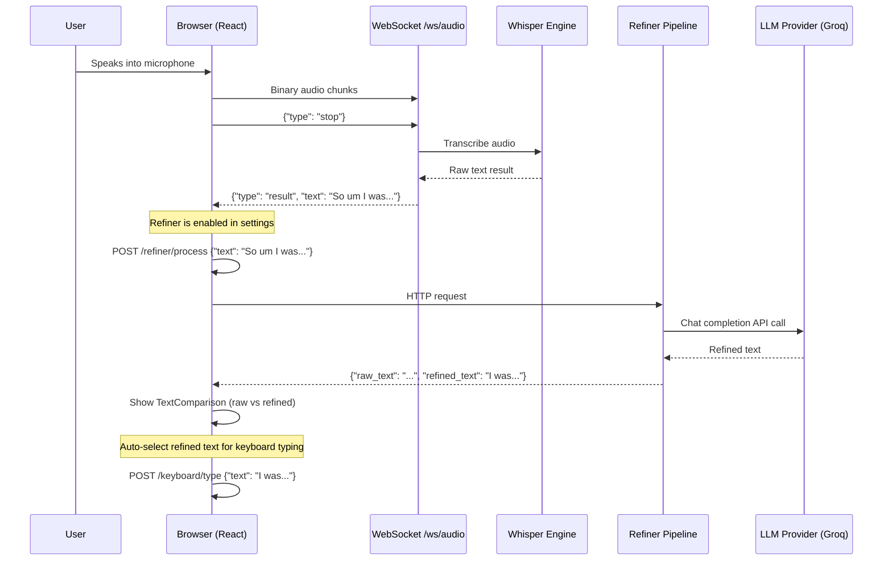
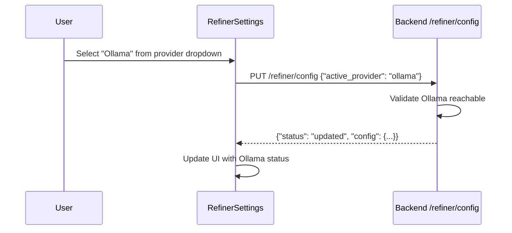
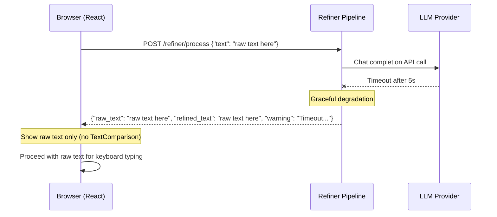
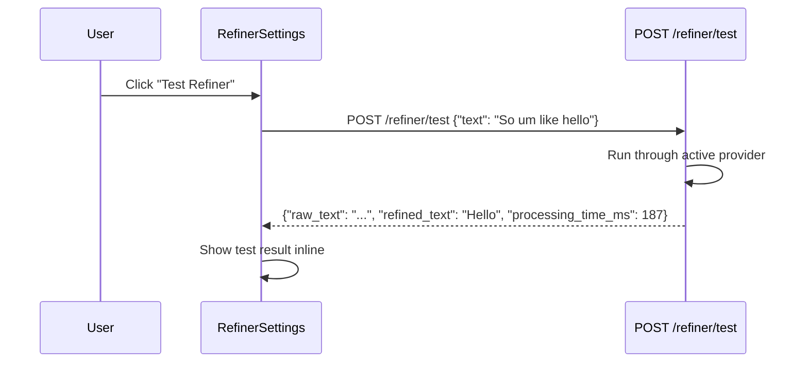

# ADD-002: BACON-AI Voice v1.1 - AI Text Refinement Architecture

**Version:** 1.1
**Status:** Draft
**Date:** 2026-02-16
**Parent:** ADD-001 (v1.0 Architecture)

---

## 1. Feature Overview

v1.1 adds an AI Text Refinement pipeline that cleans up raw Whisper transcriptions before they reach the user. Speech-to-text output often contains filler words (um, uh, ah), false starts, repetitions, and grammatical artifacts. The refiner sends raw text through a configurable LLM provider to produce clean, readable text while preserving the speaker's intent.

### Design Goals

1. **Non-blocking**: Refiner failures must never block transcription delivery
2. **Provider-agnostic**: Support multiple LLM backends via abstract provider pattern
3. **Low latency**: Target < 500ms refiner round-trip (Groq ~200ms, Ollama local ~300ms)
4. **Backend-secured**: API keys stored in backend config.json, never in frontend (aligned with PRD-002 REQ-117)
5. **User control**: Toggle on/off, see raw vs refined, choose which text to use
6. **Ollama-first**: Default provider is Ollama (works without API key, best first-run UX)

---

## 2. System Architecture (v1.1 Delta)

```
┌─────────────────────────────────────────────────────────────────────┐
│                     BROWSER (React + Vite + TS)                      │
│                                                                       │
│  ┌──────────────────────────────────────────────────────────────────┐│
│  │  Existing v1.0 Components (unchanged)                            ││
│  │  AudioCapture, ActivationController, WaveformVisualizer,         ││
│  │  StatusBar, ErrorDisplay, ModelProgress, SettingsPanel            ││
│  └──────────────────────────────────────────────────────────────────┘│
│                                                                       │
│  ┌──────────────────┐  ┌────────────────────────────────────────────┐│
│  │ RefinerSettings   │  │ TextComparison                             ││
│  │ (NEW v1.1)        │  │ (NEW v1.1)                                 ││
│  │ - Provider select │  │ - Raw text (left)                          ││
│  │ - Enable/disable  │  │ - Refined text (right)                     ││
│  │ - Custom prompt   │  │ - "Use this" buttons                       ││
│  │ - Test button     │  │ - Diff highlighting                        ││
│  └──────────────────┘  └────────────────────────────────────────────┘│
│                                                                       │
│       │ POST /refiner/process                                         │
│       │ GET  /refiner/config                                          │
│       │ POST /refiner/test                                            │
└───────┼───────────────────────────────────────────────────────────────┘
        │
        ▼
┌─────────────────────────────────────────────────────────────────────┐
│                    BACKEND (Python + FastAPI)                         │
│                                                                       │
│  ┌──────────────────────────────────────────────────────────────────┐│
│  │ Existing v1.0 (unchanged): Whisper Engine, Integration Router,   ││
│  │ Audio Converter, WebSocket Handler, Keyboard Emulator            ││
│  └──────────────────────────────────────────────────────────────────┘│
│                                                                       │
│  ┌──────────────────────────────────────────────────────────────────┐│
│  │              Refiner Module (NEW v1.1)                            ││
│  │                                                                    ││
│  │  ┌──────────────┐  ┌──────────────┐  ┌───────────────────┐      ││
│  │  │ refiner.py   │  │ prompts.py   │  │ refiner_api.py    │      ││
│  │  │ (pipeline)   │  │ (system      │  │ (FastAPI routes)  │      ││
│  │  │              │  │  prompts)    │  │                   │      ││
│  │  └──────┬───────┘  └──────────────┘  └───────────────────┘      ││
│  │         │                                                         ││
│  │         ▼                                                         ││
│  │  ┌─────────────────────────────────────────────────────────┐     ││
│  │  │              Refiner Providers                           │     ││
│  │  │  ┌──────────┐  ┌──────────────┐  ┌───────────────┐     │     ││
│  │  │  │ Groq     │  │ Ollama       │  │ Gemini        │     │     ││
│  │  │  │ (cloud)  │  │ (local)      │  │ (cloud)       │     │     ││
│  │  │  │ ~200ms   │  │ ~300ms       │  │ ~400ms        │     │     ││
│  │  │  └──────────┘  └──────────────┘  └───────────────┘     │     ││
│  │  └─────────────────────────────────────────────────────────┘     ││
│  └──────────────────────────────────────────────────────────────────┘│
└─────────────────────────────────────────────────────────────────────┘
```

---

## 3. Component Design

### 3.1 Backend: Refiner Module

#### Directory Structure

```
src/backend/app/refiner/
├── __init__.py
├── refiner.py              # Main pipeline orchestrator
├── prompts.py              # Default and custom system prompts
└── providers/
    ├── __init__.py
    ├── base.py             # Abstract BaseRefinerProvider
    ├── groq_provider.py    # Groq API via httpx
    ├── ollama_provider.py  # Ollama local API via httpx
    └── gemini_provider.py  # Gemini API via httpx
```

#### 3.1.1 BaseRefinerProvider (`providers/base.py`)

Follows the existing `IntegrationBackend` Protocol pattern from `src/backend/app/integrations/base.py`:

```python
from abc import ABC, abstractmethod
from typing import Optional
from dataclasses import dataclass


@dataclass
class RefinerResult:
    """Result from a refiner provider."""
    refined_text: str
    provider: str
    model: str
    processing_time_ms: float
    tokens_used: int  # 0 if not available


class BaseRefinerProvider(ABC):
    """
    Abstract base class for text refinement providers.

    All providers must implement the async refine() method.
    Follows the lazy-init pattern from integrations/base.py.
    """

    @abstractmethod
    async def refine(
        self,
        text: str,
        system_prompt: str,
        timeout: float = 5.0,
    ) -> RefinerResult:
        """
        Refine raw transcription text using an LLM.

        Args:
            text: Raw transcription text from Whisper.
            system_prompt: System prompt for the refinement task.
            timeout: Maximum time in seconds for the API call.

        Returns:
            RefinerResult with refined text and metadata.

        Raises:
            RefinerError: On timeout, auth failure, or provider error.
        """
        ...

    @abstractmethod
    def is_configured(self) -> bool:
        """Check if the provider has valid configuration (API key, etc.)."""
        ...

    @abstractmethod
    def get_info(self) -> dict:
        """Return provider name, model, and configuration status."""
        ...
```

#### 3.1.2 Groq Provider (`providers/groq_provider.py`)

```python
class GroqRefinerProvider(BaseRefinerProvider):
    """
    Groq API provider for text refinement.

    Uses llama-3.3-70b-versatile by default.
    Typical latency: ~200ms (fastest cloud option).
    API: https://api.groq.com/openai/v1/chat/completions
    """

    def __init__(self, api_key: str, model: str = "llama-3.3-70b-versatile"):
        self._api_key = api_key
        self._model = model
        self._client: Optional[httpx.AsyncClient] = None  # lazy init

    async def refine(self, text, system_prompt, timeout=5.0) -> RefinerResult:
        # POST to Groq OpenAI-compatible endpoint via httpx
        ...
```

#### 3.1.3 Ollama Provider (`providers/ollama_provider.py`)

```python
class OllamaRefinerProvider(BaseRefinerProvider):
    """
    Local Ollama provider for text refinement.

    Uses any locally installed model. Free, private, no API key needed.
    Typical latency: ~300ms (depends on hardware and model size).
    API: http://localhost:11434/api/chat
    """

    def __init__(self, base_url: str = "http://localhost:11434", model: str = "llama3.2"):
        self._base_url = base_url
        self._model = model
        self._client: Optional[httpx.AsyncClient] = None

    async def refine(self, text, system_prompt, timeout=5.0) -> RefinerResult:
        # POST to Ollama /api/chat endpoint
        ...

    def is_configured(self) -> bool:
        # Check if Ollama is reachable (no API key needed)
        return True  # Validated on first call
```

#### 3.1.4 Gemini Provider (`providers/gemini_provider.py`)

```python
class GeminiRefinerProvider(BaseRefinerProvider):
    """
    Google Gemini API provider for text refinement.

    Uses gemini-2.0-flash by default.
    Typical latency: ~400ms.
    API: https://generativelanguage.googleapis.com/v1beta/models/{model}:generateContent
    """

    def __init__(self, api_key: str, model: str = "gemini-2.0-flash"):
        self._api_key = api_key
        self._model = model
        self._client: Optional[httpx.AsyncClient] = None

    async def refine(self, text, system_prompt, timeout=5.0) -> RefinerResult:
        # POST to Gemini generateContent endpoint
        ...
```

#### 3.1.5 Refiner Pipeline (`refiner.py`)

```python
class Refiner:
    """
    Main refiner pipeline. Receives raw text, passes through the active
    provider, returns refined text.

    Singleton pattern (same as IntegrationRouter).
    """

    def __init__(self):
        self._providers: Dict[str, BaseRefinerProvider] = {}
        self._active_provider: str = "ollama"
        self._enabled: bool = False
        self._custom_prompt: Optional[str] = None
        self._timeout: float = 5.0

    async def process(self, raw_text: str) -> RefinerResult:
        """
        Process raw text through the active provider.

        If refiner is disabled or provider fails, returns the raw text
        unchanged (graceful degradation).
        """
        if not self._enabled:
            return RefinerResult(
                refined_text=raw_text,
                provider="none",
                model="passthrough",
                processing_time_ms=0,
                tokens_used=0,
            )

        prompt = self._custom_prompt or get_default_prompt()
        try:
            provider = self._get_provider(self._active_provider)
            return await provider.refine(raw_text, prompt, self._timeout)
        except Exception as e:
            logger.warning("Refiner failed, using raw text: %s", e)
            return RefinerResult(
                refined_text=raw_text,
                provider=self._active_provider,
                model="fallback",
                processing_time_ms=0,
                tokens_used=0,
            )
```

#### 3.1.6 Prompts Module (`prompts.py`)

```python
DEFAULT_REFINE_PROMPT = """You are a speech-to-text post-processor. Your task is to clean up
raw transcription output while preserving the speaker's original meaning.

Rules:
1. Remove filler words: um, uh, ah, like, you know, I mean, basically, actually, right
2. Remove false starts and repeated words/phrases
3. Fix obvious grammar from speech patterns (e.g., "I was gonna" -> "I was going to")
4. Preserve technical terms, proper nouns, and domain-specific language exactly
5. Do NOT add information or change the meaning
6. Do NOT summarize - keep the full content
7. Return ONLY the cleaned text with no preamble or explanation

Example:
Input: "So um I was thinking that uh we should like basically refactor the the authentication module"
Output: "I was thinking that we should refactor the authentication module"
"""

def get_default_prompt() -> str:
    return DEFAULT_REFINE_PROMPT

def get_custom_prompt(user_additions: str) -> str:
    return f"{DEFAULT_REFINE_PROMPT}\n\nAdditional instructions:\n{user_additions}"
```

### 3.2 Backend: Refiner API Routes (`refiner_api.py`)

Mounted in `main.py` as a FastAPI sub-router:

```python
# In main.py:
from .refiner_api import router as refiner_router
app.include_router(refiner_router, prefix="/refiner", tags=["refiner"])
```

#### Endpoints

| Method | Path | Description |
|--------|------|-------------|
| `POST` | `/refiner/process` | Refine raw text through the active provider |
| `GET` | `/refiner/config` | Get current refiner configuration and provider status |
| `PUT` | `/refiner/config` | Update refiner configuration (enable/disable, provider, prompt, timeout) |
| `POST` | `/refiner/test` | Test refiner with sample text, returns raw + refined for comparison |

#### POST /refiner/process

```
Request:
{
  "text": "So um I was thinking that uh we should like refactor the module",
  "provider": "groq"           // optional, uses active provider if omitted
}

Response (200):
{
  "raw_text": "So um I was thinking that uh we should like refactor the module",
  "refined_text": "I was thinking that we should refactor the module",
  "provider": "groq",
  "model": "llama-3.3-70b-versatile",
  "processing_time_ms": 187,
  "tokens_used": 42
}

Response (fallback - provider failed):
{
  "raw_text": "So um I was thinking...",
  "refined_text": "So um I was thinking...",  // same as raw
  "provider": "groq",
  "model": "fallback",
  "processing_time_ms": 0,
  "tokens_used": 0,
  "warning": "Refiner failed: Groq API timeout. Using raw text."
}
```

#### GET /refiner/config

```
Response:
{
  "enabled": true,
  "active_provider": "groq",
  "timeout_seconds": 5.0,
  "custom_prompt": null,
  "providers": {
    "groq": {
      "configured": true,
      "model": "llama-3.3-70b-versatile",
      "status": "ready"
    },
    "ollama": {
      "configured": true,
      "model": "llama3.2",
      "base_url": "http://localhost:11434",
      "status": "unreachable"
    },
    "gemini": {
      "configured": false,
      "model": "gemini-2.0-flash",
      "status": "no_api_key"
    }
  }
}
```

#### PUT /refiner/config

```
Request:
{
  "enabled": true,             // optional
  "active_provider": "ollama", // optional
  "timeout_seconds": 3.0,     // optional
  "custom_prompt": "Also fix British spelling to American spelling" // optional, null to reset
}

Response (200):
{
  "status": "updated",
  "config": { ... }  // same shape as GET /refiner/config
}
```

#### POST /refiner/test

```
Request:
{
  "text": "So um like I was wondering uh if this works",
  "provider": "groq"  // optional
}

Response (200):
{
  "raw_text": "So um like I was wondering uh if this works",
  "refined_text": "I was wondering if this works",
  "provider": "groq",
  "model": "llama-3.3-70b-versatile",
  "processing_time_ms": 203,
  "tokens_used": 38
}
```

### 3.3 Backend Configuration

API keys and refiner settings are stored in `config.json` (backend-side), not in the frontend:

```json
{
  "whisper_model": "base",
  "whisper_device": "auto",
  "server_port": 8765,
  "model_cache_dir": "~/.cache/whisper",
  "language": "en",
  "refiner": {
    "enabled": false,
    "active_provider": "groq",
    "timeout_seconds": 5.0,
    "custom_prompt": null,
    "providers": {
      "groq": {
        "api_key": "gsk_...",
        "model": "llama-3.3-70b-versatile"
      },
      "ollama": {
        "base_url": "http://localhost:11434",
        "model": "llama3.2"
      },
      "gemini": {
        "api_key": "",
        "model": "gemini-2.0-flash"
      }
    }
  }
}
```

### 3.4 Frontend Components

#### 3.4.1 RefinerSettings (`RefinerSettings.tsx`)

Renders within the existing SettingsPanel as a new collapsible section:

```
┌─────────────────────────────────────┐
│ AI Text Refinement          [toggle]│
│                                     │
│ Provider: [Groq          ▼]        │
│ Model:    llama-3.3-70b-versatile  │
│ Status:   Ready                     │
│ Timeout:  [====|=====] 5.0s        │
│                                     │
│ Custom Prompt:                      │
│ ┌─────────────────────────────────┐ │
│ │ (optional additional prompt)    │ │
│ └─────────────────────────────────┘ │
│                                     │
│ [Test Refiner]  [Save Config]       │
│                                     │
│ Test Result:                        │
│ Raw:     "So um I was thinking..."  │
│ Refined: "I was thinking..."        │
│ Time:    187ms                      │
└─────────────────────────────────────┘
```

Props:
```typescript
interface RefinerSettingsProps {
  settings: AppSettings;
  onUpdate: (updates: Partial<AppSettings>) => void;
  backendUrl: string;
}
```

The component fetches provider status from `GET /refiner/config` and sends updates via `PUT /refiner/config`. The test button calls `POST /refiner/test`.

#### 3.4.2 TextComparison (`TextComparison.tsx`)

Replaces the simple textarea in TranscriptionDisplay when refiner is enabled:

```
┌──────────────────────────────────────────────────┐
│ Latest Transcription                    95%      │
│                                                  │
│ ┌──────────────────┐  ┌──────────────────┐      │
│ │ Raw              │  │ Refined (Groq)   │      │
│ │                  │  │                  │      │
│ │ So um I was      │  │ I was thinking   │      │
│ │ thinking that uh │  │ that we should   │      │
│ │ we should like   │  │ refactor the     │      │
│ │ refactor the the │  │ authentication   │      │
│ │ authentication   │  │ module.          │      │
│ │ module.          │  │                  │      │
│ │                  │  │                  │      │
│ │ [Use Raw]        │  │ [Use Refined] *  │      │
│ └──────────────────┘  └──────────────────┘      │
│                                                  │
│ * = auto-selected for keyboard typing            │
│ Refined in 187ms via Groq                        │
│                                                  │
│ [Copy to Clipboard] [Download .md]               │
└──────────────────────────────────────────────────┘
```

Props:
```typescript
interface TextComparisonProps {
  rawText: string;
  refinedText: string | null;  // null if refiner disabled or failed
  provider: string;
  processingTimeMs: number;
  onSelectText: (text: string) => void;  // callback when user picks raw or refined
}
```

### 3.5 Frontend Type Extensions

Added to `src/frontend/src/types/index.ts`:

```typescript
// Refiner settings stored in AppSettings (frontend localStorage)
// NOTE: API keys are NOT stored here - they live in backend config.json (REQ-117)
export interface RefinerSettings {
  enabled: boolean;
  activeProvider: 'groq' | 'ollama' | 'gemini';
  customPrompt: string;  // empty string = use default
}

// Extend AppSettings
export interface AppSettings {
  // ... existing fields ...
  refiner: RefinerSettings;
}

// Extend DEFAULT_SETTINGS
export const DEFAULT_SETTINGS: AppSettings = {
  // ... existing defaults ...
  refiner: {
    enabled: false,
    activeProvider: 'ollama',  // Default: Ollama (works without API key)
    customPrompt: '',
  },
};

// Refiner result from POST /refiner/process
export interface RefinerResult {
  raw_text: string;
  refined_text: string;
  provider: string;
  model: string;
  processing_time_ms: number;
  tokens_used: number;
  warning?: string;
}
```

---

## 4. Data Flow

### 4.1 Normal Transcription with Refiner Enabled



### 4.2 Provider Switching



### 4.3 Error / Fallback Scenario



### 4.4 Test Endpoint Flow



---

## 5. Integration Points

### 5.1 App.tsx Integration

The refiner hooks into the existing transcription flow in `App.tsx`:

```typescript
// In App.tsx, after receiving lastResult from useWebSocket:
useEffect(() => {
  if (!lastResult || !settings.refiner.enabled) return;

  const httpUrl = settings.backendUrl.replace('ws://', 'http://').replace('wss://', 'https://');

  fetch(`${httpUrl}/refiner/process`, {
    method: 'POST',
    headers: { 'Content-Type': 'application/json' },
    body: JSON.stringify({ text: lastResult.text }),
  })
    .then(res => res.json())
    .then(data => setRefinerResult(data))
    .catch(() => setRefinerResult(null));  // graceful degradation
}, [lastResult, settings.refiner.enabled, settings.backendUrl]);
```

### 5.2 TranscriptionDisplay Integration

When refiner is enabled and a result exists, `TranscriptionDisplay` renders `TextComparison` instead of the plain textarea:

- **Refiner off**: Shows existing textarea with raw text (no change from v1.0)
- **Refiner on, result received**: Shows `TextComparison` side-by-side
- **Refiner on, result pending**: Shows raw text with "Refining..." spinner
- **Refiner on, result failed**: Shows raw text with warning toast

### 5.3 Keyboard Typing Integration

When `typeToKeyboard` is enabled:
- **Refiner off**: Types raw transcription text (v1.0 behavior)
- **Refiner on**: Types the refined text automatically
- User can override by clicking "Use Raw" in the TextComparison component

The typing decision is made in `TranscriptionDisplay` where the `POST /keyboard/type` call already exists. The text passed to that call changes based on refiner state.

### 5.4 useSettings Hook Integration

The `useSettings` hook already merges partial updates via `{ ...DEFAULT_SETTINGS, ...parsed }`. Adding `refiner` to `DEFAULT_SETTINGS` is backwards-compatible - existing localStorage data without `refiner` will get the defaults automatically.

### 5.5 SettingsPanel Integration

`RefinerSettings` is rendered as a new collapsible section in `SettingsPanel`, after the existing settings groups. It communicates with the backend directly for provider-specific config (API keys stay backend-side).

### 5.6 main.py Integration

The refiner API router is mounted in `main.py`:

```python
from .refiner_api import router as refiner_router
app.include_router(refiner_router, prefix="/refiner", tags=["refiner"])
```

This adds the three endpoints without modifying any existing endpoint.

---

## 6. Error Handling

### 6.1 Error Categories and Responses

| Error | Detection | Frontend UX | Backend Behavior |
|-------|-----------|-------------|------------------|
| Provider timeout | httpx.TimeoutException | Warning toast, show raw text | Return raw text as refined_text + warning |
| API key invalid | 401/403 from provider | "API key invalid" in RefinerSettings | Return error in config status |
| API key missing | Empty in config.json | Provider shows "Not configured" | Skip provider, return raw text |
| Rate limited | 429 from provider | Warning toast with retry-after | Return raw text + warning |
| Network failure | httpx.ConnectError | Warning toast | Return raw text + warning |
| Ollama not running | Connection refused | "Ollama not reachable" status | Mark provider as unreachable |
| Invalid response | Missing/malformed JSON | Warning toast, show raw text | Return raw text + warning |
| Refiner disabled | settings.refiner.enabled = false | No refiner UI shown | N/A (not called) |

### 6.2 Graceful Degradation Principle

**The refiner must NEVER block or delay the core transcription experience.**

- If the refiner fails for any reason, the raw transcription text is used as-is
- The user sees a brief warning but can continue working immediately
- Keyboard typing uses raw text if refinement fails
- No retry logic on the refiner (user can re-trigger manually)

---

## 7. Security Considerations

### 7.1 API Key Management

- API keys are stored in `config.json` on the backend filesystem
- The frontend never sends or receives API keys
- The `GET /refiner/config` endpoint returns `"configured": true/false` but never the key value
- The `PUT /refiner/config` endpoint accepts API key updates (for initial setup) but these are stored server-side only
- `config.json` should be in `.gitignore` (already is)

### 7.2 Network Security

- All refiner API calls from backend to providers use HTTPS
- Frontend-to-backend communication remains localhost-only
- Ollama communication is localhost-only (http://localhost:11434)
- No transcription text is stored or logged beyond the current session

### 7.3 Input Validation

- Raw text length limited to 10,000 characters per request
- System prompts limited to 2,000 characters
- Provider names validated against known list
- Timeout clamped to 1.0-30.0 seconds range

---

## 8. Technology Decisions

| Decision | Choice | Rationale |
|----------|--------|-----------|
| HTTP client | httpx (async) | Already async, lightweight, no SDK dependencies |
| Provider pattern | ABC inheritance | Matches existing IntegrationBackend pattern |
| API key storage | Backend config.json | More secure than frontend localStorage |
| Default provider | Ollama | Works without API key, best first-run UX (aligned with PRD-002) |
| Fallback model (Groq) | llama-3.3-70b-versatile | Best quality/speed balance on Groq |
| Ollama default model | llama3.2 | Small, fast, good for text cleanup |
| Gemini default model | gemini-2.0-flash | Fast, cost-effective |
| Frontend-to-refiner | REST (not WebSocket) | Simple request/response, no streaming needed |

---

## 9. File Changes Summary

### New Files

| File | Description |
|------|-------------|
| `src/backend/app/refiner/__init__.py` | Package init, exports get_refiner() singleton |
| `src/backend/app/refiner/refiner.py` | Main pipeline: text in -> provider -> refined text out |
| `src/backend/app/refiner/prompts.py` | Default and custom system prompts for speech cleanup |
| `src/backend/app/refiner/providers/__init__.py` | Provider package init |
| `src/backend/app/refiner/providers/base.py` | Abstract BaseRefinerProvider with RefinerResult |
| `src/backend/app/refiner/providers/groq_provider.py` | Groq API provider via httpx |
| `src/backend/app/refiner/providers/ollama_provider.py` | Ollama local API provider via httpx |
| `src/backend/app/refiner/providers/gemini_provider.py` | Gemini API provider via httpx |
| `src/backend/app/refiner_api.py` | FastAPI router: POST /process, GET /config, PUT /config, POST /test |
| `src/frontend/src/components/RefinerSettings.tsx` | Settings UI for refiner provider, toggle, test |
| `src/frontend/src/components/RefinerSettings.css` | Styles for RefinerSettings |
| `src/frontend/src/components/TextComparison.tsx` | Raw vs refined side-by-side display |
| `src/frontend/src/components/TextComparison.css` | Styles for TextComparison |

### Modified Files

| File | Change |
|------|--------|
| `src/frontend/src/types/index.ts` | Add RefinerSettings interface, extend AppSettings, add RefinerResult type |
| `src/frontend/src/hooks/useSettings.ts` | Add refiner defaults to DEFAULT_SETTINGS |
| `src/frontend/src/App.tsx` | Add refiner effect after transcription result, pass refiner state to TranscriptionDisplay |
| `src/frontend/src/components/TranscriptionDisplay.tsx` | Conditionally render TextComparison, use refined text for keyboard typing |
| `src/frontend/src/components/SettingsPanel.tsx` | Add RefinerSettings section |
| `src/backend/app/main.py` | Mount refiner_api router |
| `src/backend/app/config.py` | Add refiner config loading from config.json |
| `src/backend/pyproject.toml` | Add dependency: `httpx>=0.27` |

### Unchanged Files

All existing v1.0 files not listed above remain unchanged. The refiner is purely additive.

---

## 10. Testing Strategy

### Unit Tests (Backend)

| Test File | Scope | Count Est. |
|-----------|-------|------------|
| `tests/unit/test_refiner.py` | Refiner pipeline (enable/disable, fallback) | 8 |
| `tests/unit/test_refiner_providers.py` | Provider base class, mocked API calls | 12 |
| `tests/unit/test_refiner_api.py` | API endpoint request/response validation | 10 |
| `tests/unit/test_prompts.py` | Prompt generation and customization | 4 |

### Unit Tests (Frontend)

| Test File | Scope | Count Est. |
|-----------|-------|------------|
| `tests/unit/RefinerSettings.test.tsx` | Settings UI rendering, provider selection | 6 |
| `tests/unit/TextComparison.test.tsx` | Side-by-side display, text selection | 6 |
| `tests/unit/useSettings.refiner.test.ts` | Refiner settings persistence | 4 |

### Integration Tests

| Test | Scope |
|------|-------|
| Refiner + TranscriptionDisplay | End-to-end: transcription -> refiner -> display |
| Refiner + Keyboard Typing | Refined text typed correctly |
| Config persistence | Settings saved/loaded across restarts |

---

*Document end. Awaiting human review at CP-3 checkpoint.*
